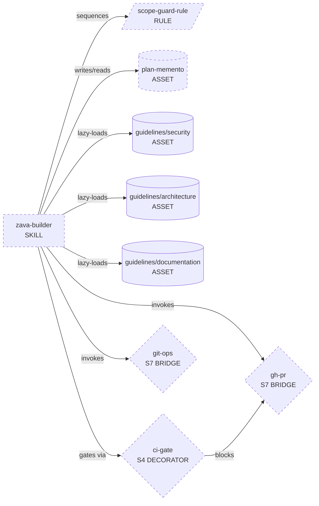
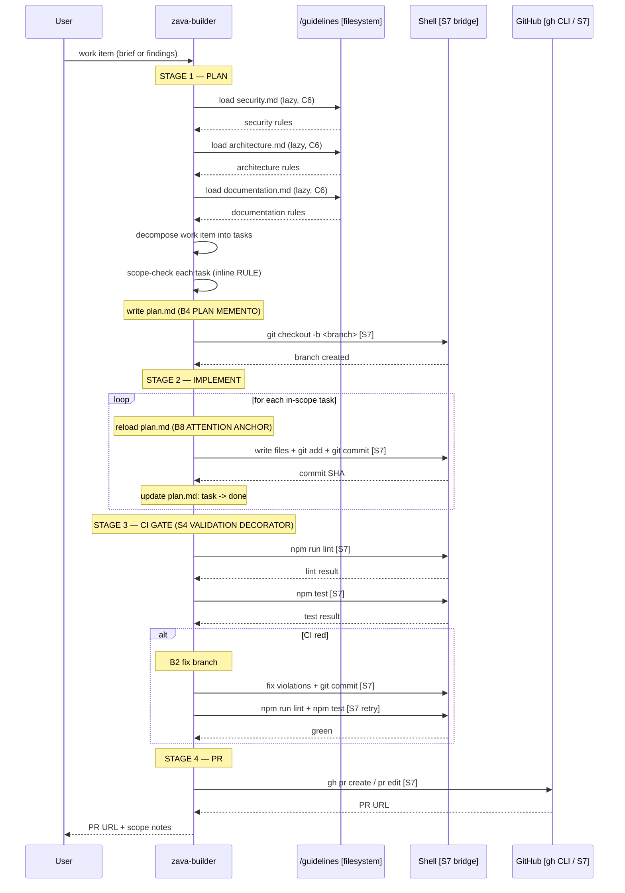
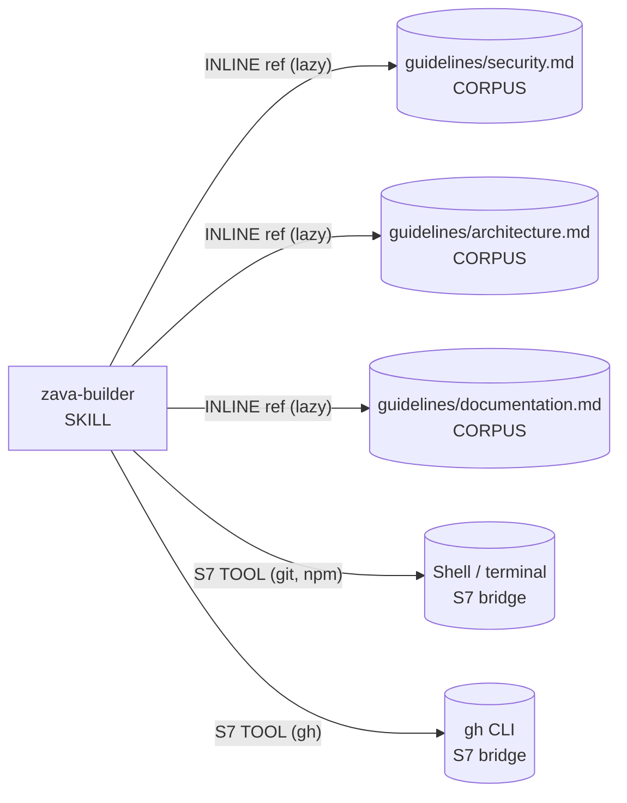

# zava-builder — Genesis Handoff Packet

> Produced by: genesis skill (design steps 1–6)
> Date: 2026-06-22
> Status: DESIGN COMPLETE. Coding step (7b) begins from this file.

---

## Step 1 — Intent + Scope

**User-facing capability:** Given a work item — either a short feature brief or a set of
review findings to address — the skill implements the change as commits on a new branch
and opens (or updates) a pull request on `zava-storefront`. Before writing any code it
reads the team's guideline files (`/guidelines/security.md`, `/guidelines/architecture.md`,
`/guidelines/documentation.md`) so the output already follows project standards. It stays
within the work item's scope: anything judged out-of-scope is noted in the PR body for a
human instead of built. Before opening or updating the PR it runs `npm run lint` and
`npm test`; if either is red it auto-fixes the violations and retries before proceeding.
The PR is only opened when both checks are green.

**Boundary (what it does NOT do):** Design decisions, dependency architecture choices, or
changes spanning multiple services without an ADR — those are surfaced as notes in the PR
description. It does not run the full release pipeline. It does not bypass CI.

**Single-responsibility check:** "implement work item → open PR" is one pipeline with
ordered stages, not two distinct capabilities. No split warranted.

**Dispatch description (frontmatter `description` draft):**

> Use this skill when given a work item — a feature brief, a list of review findings, a
> ticket, acceptance criteria, or diff-level feedback — and tasked with implementing it
> in the zava-storefront repo. Triggers on: "implement this", "fix these findings", "build
> this feature", "apply these review comments", "create a PR for", "open a pull request
> for", or whenever the user pastes a ticket or feedback list expecting code output. The
> skill reads /guidelines before writing code, stays in scope, runs npm run lint and npm
> test, fixes failures, then commits and opens or updates the pull request. Does NOT handle
> multi-service architecture decisions or changes requiring an ADR; surfaces those in the
> PR description for a human.

Length: 788 characters. ✓ Within 1024-char hard cap.

**Invocation mode:** FORCED (user explicitly hands a work item; consequential writes mean
DISCOVERY-only binding would be too broad).

---

## Step 2 — Component Diagram

All items marked `:::new` are new primitives or inline constructs.
`guidelines/*` files already exist in the repository.
`ci-gate`, `git-ops`, `gh-pr` are S7 TOOL BRIDGE steps INLINE within `zava-builder`
(not separate modules — they do not meet rule-of-three for extraction).

---

## Step 3 — Thread / Sequence Diagram

**Architectural pattern selected: A2 PIPELINE**

Rationale:
1. R1 SPLIT triggers checked — none fire. Single description noun-phrase.
2. A2 PIPELINE matches: ordered stages with verifiable hand-offs, different mental mode per
   stage, sequential dependency (cannot implement before planning, cannot open PR before CI
   passes).
3. NOT A1 PANEL / B1 FAN-OUT: lenses are NOT independent. Each stage consumes the prior
   stage's output. Single thread is correct.
4. NOT A3 SAGA: single-session, no cross-session durability required (a single PR run
   completes in one invocation).

Tier-2 patterns composed:
- B4 PLAN MEMENTO (plan.md persisted between stages — mandatory on non-trivial work)
- B8 ATTENTION ANCHOR (plan reloaded before each task in IMPLEMENT stage — mandatory)
- B2 CONDITIONAL DISPATCH (in-scope task vs note-it branch; CI-pass vs CI-fail branch)
- S7 DETERMINISTIC TOOL BRIDGE (git, npm, gh commands — consequential writes)
- S4 VALIDATION DECORATOR (CI gate blocking PR stage if red)
- S3 ORCHESTRATOR FACADE (single dispatch entry hiding pipeline topology)
- C6 EXTERNAL CORPUS GROUNDING (guidelines files loaded lazily by named path)

Single-writer interlock: only `zava-builder` writes to `plan.md` and the branch.
No fan-out → no shared-sink race condition.

---

## Step 3.5 — Composition Decision

Load authority: `assets/composition-substrate.md`

| Box | Composition mode | Rationale |
|-----|-----------------|-----------|
| `zava-builder` SKILL | LOCAL SIBLING (new, `.agents/skills/zava-builder/`) | Owned by this project; not needed in 3+ other projects (rule-of-three does not fire); no independent release cadence |
| `guidelines/security.md` | INLINE reference (existing filesystem corpus) | Pre-existing file at known path; read-only; not a module dep |
| `guidelines/architecture.md` | INLINE reference | Same |
| `guidelines/documentation.md` | INLINE reference | Same |
| Scope-guard logic | INLINE within `zava-builder` body | 3–4 sentences; single caller; no rule-of-three |
| plan.md (runtime artifact) | INLINE session artifact | Not a module; written to working dir at runtime |
| ci-gate (S7 steps) | INLINE within `zava-builder` | Shell invocations; not a reusable module |
| git-ops (S7 steps) | INLINE within `zava-builder` | Same |
| gh-pr (S7 steps) | INLINE within `zava-builder` | Same |

**No external modules declared.** The guidelines are filesystem files (existing project
corpus), not module-system dependencies. No manifest entries required.

**Dependency graph:**

BUNDLE LEAKAGE check: eval scenarios must live in `dev/skills/zava-builder-evals/`,
NOT inside `.agents/skills/zava-builder/` — the harness scanner would treat eval prompts
as real user requests and pull them into active context (DISPATCH CONTAMINATION).

---

## Step 4 — SoC Pass

| Check | Finding |
|-------|---------|
| Existing module does this? | No. `tdd`, `review`, `panel-review`, `to-issues` checked. None open PRs from work items. |
| Trigger collision with `tdd`? | LOW risk. `tdd` triggers on "red-green-refactor, test-first, TDD". Mitigate: `zava-builder` description names "work item → pull request" not "test-driven"; dispatcher can distinguish. |
| Trigger collision with `review`? | None. `review` triggers on "review since X, branch, PR". Different domain. |
| R1 SPLIT triggers? | None. Single description noun-phrase. Single lens (implement-to-PR). No conjunction. No multi-lens body. |
| R2 FUSE? | Nothing to fuse. Single new module. |
| R3 EXTRACT? | Scope-guard logic is 3–4 lines; too small; no rule-of-three. INLINE. |
| R4 INLINE? | No proxy. |
| Consequential side effects named? | YES: `git commit`, `git push` (branch), `gh pr create/edit`. All cross S7 ✓ |
| Facts-that-must-be-true named? | YES: CI pass/fail, branch name, PR existence. All via tool calls ✓ |

---

## Step 5 — Compliance Check

| Axis | Check | Status |
|------|-------|--------|
| Classic | Single responsibility | ✓ PASS |
| Classic | `name` = `zava-builder` (12 chars, `[a-z0-9-]`, no bad hyphens) | ✓ PASS |
| Classic | `name` equals parent directory name | ✓ (`.agents/skills/zava-builder/SKILL.md`) |
| Classic | `description` ≤ 1024 chars | ✓ 788 chars |
| Classic | `description` imperative phrasing | ✓ "Use this skill when…" |
| Classic | `description` user-intent framing | ✓ |
| Classic | `description` indirect triggers named | ✓ |
| Classic | SKILL.md body ≤ 500 lines / ≤ 5000 tokens | ENFORCE at step 7b |
| PROSE | Progressive Disclosure | ✓ (guidelines loaded lazily at plan stage) |
| PROSE | Reduced Scope | ✓ (scope-guard rule keeps implementation bounded) |
| PROSE | Orchestrated Composition | ✓ (four named stages, clear sequencing) |
| PROSE | Safety Boundaries | ✓ (CI gate before PR; S7 for writes; S4 gate) |
| PROSE | Explicit Hierarchy | ✓ (Plan → Implement → CI Gate → PR) |
| LLM physics | B4 PLAN MEMENTO mandatory | ✓ PLANNED |
| LLM physics | B8 ATTENTION ANCHOR mandatory | ✓ PLANNED |
| LLM physics | No LLM-asserted side effects (S7 for all writes) | ✓ PLANNED |
| Portability | No per-harness syntax in design | ✓ |

**Open findings:**

| Severity | Finding |
|----------|---------|
| MEDIUM | B10 HUMAN CHECKPOINT before `gh pr create` recommended per S7 anti-pattern "UNGUARDED DESTRUCTIVE TOOL". PR is reversible so blocking is waiveable; operator may configure fully-automated flow. Noted in PR description step as a "show diff summary before confirming" gate. |
| LOW | Dispatch proximity to `tdd`. Mitigated by precise description wording. Monitor with trigger evals. |

No BLOCKER findings. Design proceeds to handoff.

---

## Step 6 — Module Interface Sketches

### Module: `zava-builder`

| Field | Value |
|-------|-------|
| Type | SKILL (MODULE ENTRYPOINT) |
| Trigger | FORCED |
| Input | Work item text (feature brief OR review findings list) |
| Output | PR URL + scope-notes list |
| Dependencies | `/guidelines/security.md`, `/guidelines/architecture.md`, `/guidelines/documentation.md` (lazy corpus); terminal (S7 for git + npm); gh CLI (S7 for PR) |
| Assets | `assets/pr-template.md` (inline PR body template, load at Stage 4) |
| Dir | `.agents/skills/zava-builder/` |

---

## Module Composition Table

| Module / construct | Mode | Rationale |
|-------------------|------|-----------|
| `zava-builder` | LOCAL SIBLING | This project; single consumer |
| Scope-guard logic | INLINE | <5 lines; one caller |
| plan.md (artifact) | INLINE session | Runtime file, not a shipped primitive |
| Guidelines corpus | INLINE ref (C6) | Existing files; read-only; lazy |
| ci-gate, git-ops, gh-pr | INLINE S7 | Shell calls; no reuse across projects |

---

## External Modules Required

None. No manifest dependency entries needed.

---

## Declared Target Set

`common-only` — no per-harness syntax in any module body.

---

## Evals Plan

### Content evals (2)

**Eval 1 — Feature brief → PR**
- Prompt: "Implement a new `/health` endpoint that returns `{ status: 'ok' }` on GET."
- Expected `with_skill`: branch created; code written following architecture.md layers;
  PR opened with description that notes scope; lint + test pass confirmed.
- Expected `without_skill`: agent may attempt to write code but will not branch, will not
  run CI, will not open a PR.

**Eval 2 — Review findings → fixes + PR update**
- Prompt: "These review findings need to be addressed: [1] Missing input validation on
  `POST /orders`. [2] SQL query is concatenated, not parameterized."
- Expected `with_skill`: fixes applied per security.md rules; PR updated; CI passes.
- Expected `without_skill`: agent may suggest fixes in prose but will not commit them.

### Trigger evals (~20 queries, 60/40 train/val)

**SHOULD trigger (training — 12):**
1. "Implement ticket ZAVA-42: add discount code field to checkout"
2. "Here are the review comments, please fix them and update the PR"
3. "Build the feature described in this brief: [paste]"
4. "Apply these code review findings to a branch"
5. "Create a pull request for this feature"
6. "Fix the issues from the last PR review and push"
7. "Implement this acceptance criteria: [paste]"
8. "Here's the feature spec, go build it"
9. "These findings need addressing, open a PR when done"
10. "Take this work item and implement it"
11. "Push a branch with this change and open a PR"
12. "My PM sent this brief, please implement it"

**SHOULD NOT trigger — near-miss (val — 8):**
1. "Review my branch since main" → `review` skill
2. "Can you explain what this code does?" → Q&A, no implementation
3. "Write tests for this function using TDD" → `tdd` skill
4. "What are the architecture guidelines?" → Q&A
5. "Create a GitHub issue for this feature" → `to-issues` skill
6. "Refactor this module" (no PR intent, no branch) → generic coding
7. "Run lint on my code and tell me what's wrong" → direct tool use, no PR
8. "Generate release notes for this sprint" → different capability

---

## Todo List (for coding step 7b)

- [ ] 7a: portability check (load `assets/runtime-affordances/common.md`)
- [ ] 7b-1: draft `SKILL.md` body for `zava-builder` (reload this plan first)
- [ ] 7b-2: draft `assets/pr-template.md` (inline PR body template)
- [ ] 8: validate SKILL.md against budget (≤500 lines / ≤5000 tokens), name regex,
       description cap, ASCII-only, no per-harness syntax
- [ ] 8: create `evals/evals.json` with content evals + trigger evals
- [ ] 8: run real task (one real work item) and revise from trace
